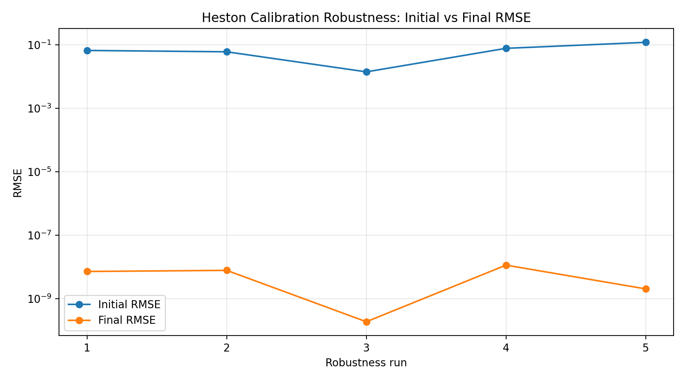
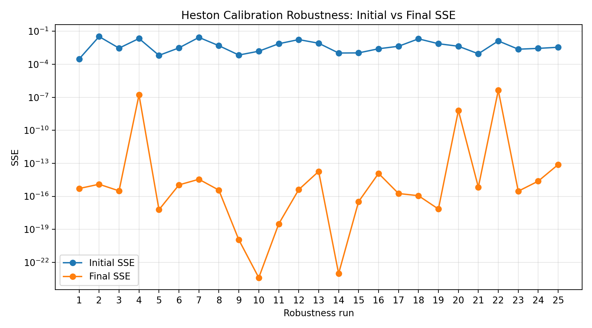

# Volatility Model Calibration Pipeline


A Python project for option pricing, implied-volatility inversion, volatility-surface generation, and Heston model calibration.

The project is structured as a small calibration pipeline rather than a single exploratory notebook. It includes pricing routines, implied-volatility inversion, calibration error metrics, bounded least-squares optimisation, a Heston characteristic-function pricer, synthetic volatility-surface generation, and robustness experiments.

## Motivation

In options markets, volatility models are often assessed through the implied-volatility surface rather than through raw option prices alone. A useful calibration pipeline should therefore connect the following steps:

```text
model parameters
-> option prices
-> implied volatilities
-> residuals against a target surface
-> calibration error
-> optimiser update
```

This repository implements that workflow in a modular way so that each layer can be tested independently.

## Project Structure

```text
src/volcal/
  pricing/        Black-Scholes pricing, implied-volatility inversion, Heston pricing
  calibration/    bounds, metrics, objective functions, optimisers, Heston calibration
  data/           synthetic volatility-surface generation
  utils/          reproducibility utilities

scripts/
  make_figures.py
  run_recovery.py
  run_robustness.py
  plot_robustness.py

tests/
  unit and integration tests for pricing, calibration, recovery, robustness, and plotting
```

## Current Features

- Black-Scholes call and put pricing
- Implied-volatility inversion
- Synthetic implied-volatility surface generation
- Calibration error metrics including SSE, RMSE, MAE, and maximum absolute error
- Bounded least-squares optimisation
- Heston characteristic-function call pricing
- Heston implied-volatility calibration against synthetic target surfaces
- Synthetic recovery experiment using known Heston parameters
- Robustness experiment across multiple Heston starting guesses
- Diagnostic plots for calibration error reduction
- Automated tests covering pricing, calibration, recovery, robustness, and plotting

## Heston Robustness Diagnostics

The robustness experiment tests whether the Heston calibration routine behaves sensibly across several different starting parameter vectors.

For each run, the pipeline records the initial calibration error and the final calibration error after bounded least-squares optimisation. The plots below compare the initial and final RMSE/SSE values across the robustness runs.





In this synthetic setting, the optimiser substantially reduces calibration error from different starting guesses. This is useful as a controlled diagnostic, but it should not be interpreted as proof that Heston calibration is globally well-posed. In practice, stochastic-volatility calibration can suffer from parameter sensitivity and non-identifiability: different parameter vectors may generate similar implied-volatility surfaces.

## Reproducibility

Create and activate a virtual environment, then install the project in editable mode:

```powershell
python -m venv .venv
Set-ExecutionPolicy -Scope Process -ExecutionPolicy Bypass
.venv\Scripts\Activate.ps1
pip install -e .
```

Run the full test suite:

```powershell
python -m pytest -q
```

Generate the synthetic Heston recovery table:

```powershell
python scripts/run_recovery.py
```

Generate the robustness experiment table:

```powershell
python scripts/run_robustness.py
```

Generate robustness diagnostic plots:

```powershell
python scripts/plot_robustness.py
```

## Example Outputs

Generated tables are stored in:

```text
results/tables/
```

Generated figures are stored in:

```text
results/figures/
```

Key artefacts include:

```text
results/tables/heston_recovery_summary.csv
results/tables/heston_robustness_summary.csv
results/figures/heston_robustness_rmse.png
results/figures/heston_robustness_sse.png
```

## Technical Focus

The main technical focus is not only to price options, but to build a testable calibration workflow:

```text
pricing model
-> implied-volatility inversion
-> residual construction
-> optimiser
-> diagnostics
-> reproducible output
```

This makes the project closer to a small quant-development pipeline than a one-off notebook calculation.

## Limitations and Next Steps

The current experiments use synthetic data, which is useful for controlled testing but does not capture all the complications of real option markets. Natural extensions include:

- real option-chain ingestion
- market-data cleaning and filtering
- bid-ask aware calibration
- comparison of multiple stochastic-volatility models
- richer parameter-identifiability diagnostics
- calibration against observed volatility surfaces

## Theory Notes

A concise explanation of the mathematical and numerical ideas behind the calibration pipeline is available here:

[Heston Model Calibration Notes](docs/heston_theory.md)

The note covers the Heston model, implied-volatility calibration, least-squares optimisation, error metrics, function evaluations, and the multi-start robustness experiment.